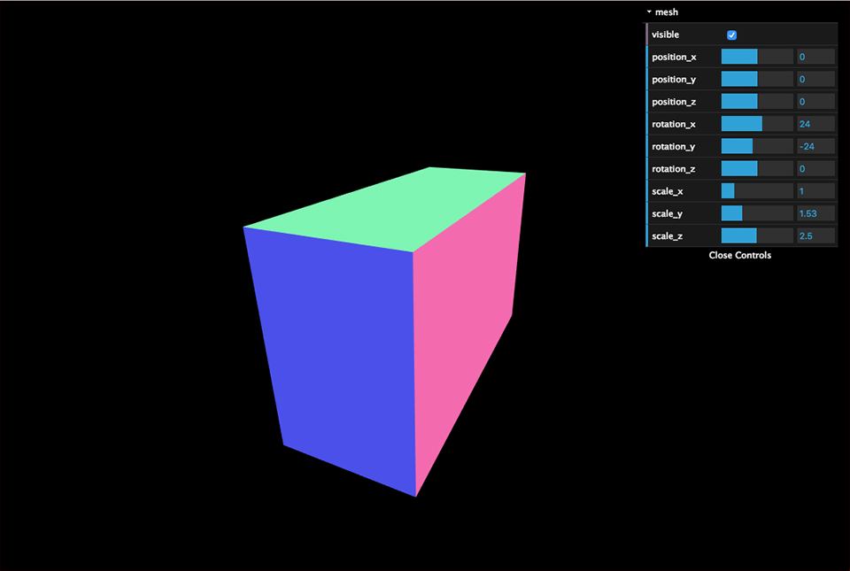
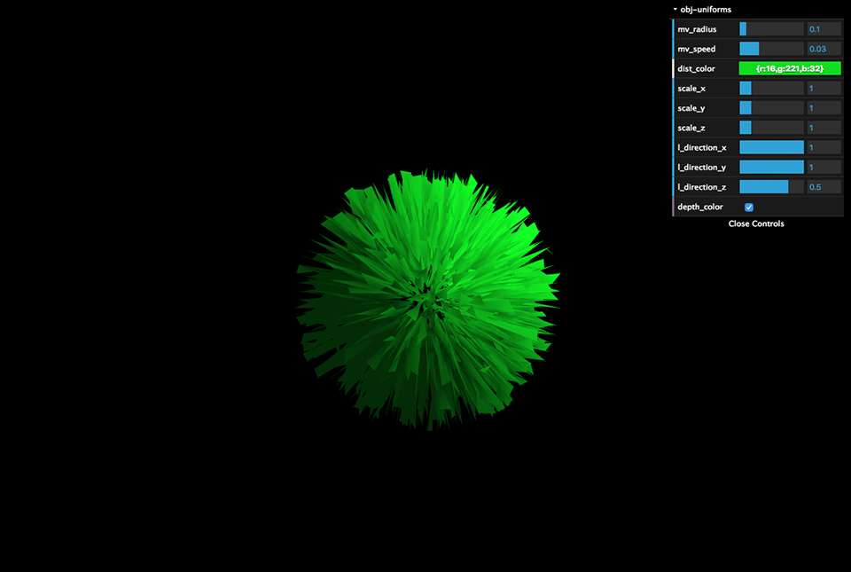

gui.three.js
========

#### three.js & dat.GUI library ####

[three.js](https://github.com/mrdoob/three.js)
[dat.GUI](https://github.com/dataarts/dat.gui)

### Usage ###

```html
<script src="js/three.min.js"></script>
<script src="js/dat.gui.min.js"></script>
<script src="js/gui.three.min.js"></script>
```

```javascript

const gui = new dat.GUI();

// for mesh
/**
 * @param GUI name
 * @param dat.GUI
 * @param THREE.Mesh
 * @param folder hidden
 * @param change method
 */
new GUITHREE.Object3D('mesh', gui, mesh, true, null);


// for uniforms
const uniforms = {
	time:        {type: 'i',    value: 0,          options: {visible: false}},
	mv_radius:   {type: 'i',    value: .1,         options: {min: 0, step: .01, name: '距離'}},
	mv_speed:    {type: 'f',    value: .03,        options: {min: 0, max: .1, step: .01, name: '速度'}},
	dist_color:  {type: 'c',    value: new THREE.Color(0x10dd20), options: {name: 'カラー'}},
	scale:       {type: 'v3',   value: new THREE.Vector3(1, 1, 1),  options: {min: .1, max: 5, step: .1, name: 'スケール'}},
	l_direction: {type: 'v3',   value: [1, 1, .5], options: {min: -1, max: 1, step: .01, name: '向き'}},
	depth_color: {type: 'bool', value: true, options: {name: '深度'}},
	type: {type: 'i', value: 0, options: {name: 'タイプ', select: {'Sphere': 0, 'Random': 1}}},
};

/**
 * @param GUI name
 * @param dat.GUI
 * @param uniforms
 * @param folder hidden
 * @param change method
 */
new GUITHREE.Uniforms('obj-uniforms', gui, uniforms, true, null);

```

[](./ss1.png)
[](./ss2.png)
